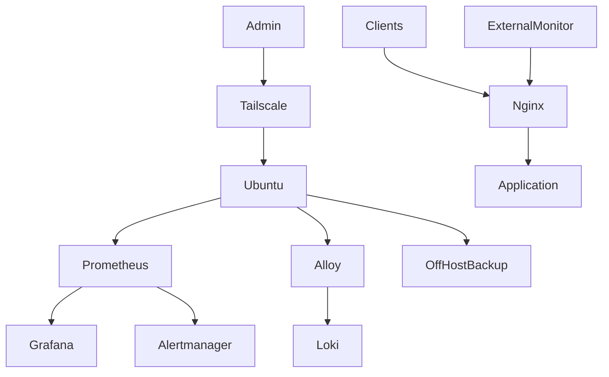

# Planned infrastructure

```mermaid
flowchart TD
  Clients --> Nginx
  Admin --> Tailscale
  Tailscale --> Ubuntu
  Nginx --> Application
  Ubuntu --> Prometheus
  Prometheus --> Grafana
  Prometheus --> Alertmanager
  Ubuntu --> Alloy
  Alloy --> Loki
  Ubuntu --> OffHostBackup
  ExternalMonitor --> Nginx
```

Validate against actual infrastructure. Services sharing the Ubuntu host share its failure modes.
